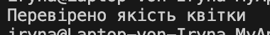

# Visitor
Ідея відвідувачa: 

дозволяє додавати нову поведінку до об’єктів без зміни їхнього коду.

Як працює код: 

об’єкт “відвідувач” проходить по всіх елементах і виконує дію.

Навіщо: 

додає нову логіку, не змінюючи існуючі класи.

## Код
```csharp
using System;

class Flower
{
    public void Accept(Action<Flower> visitor) => visitor(this);
}

class Program
{
    static void Main()
    {
        var flower = new Flower();
        flower.Accept(f => Console.WriteLine("Перевірено якість квітки "));
    }
}
```
## Результат

